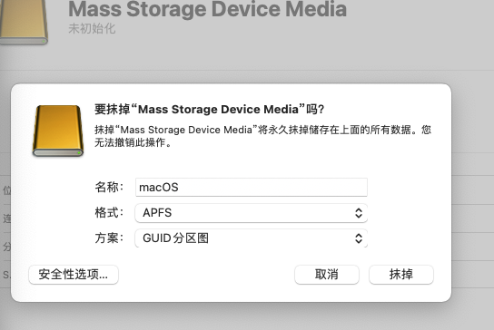
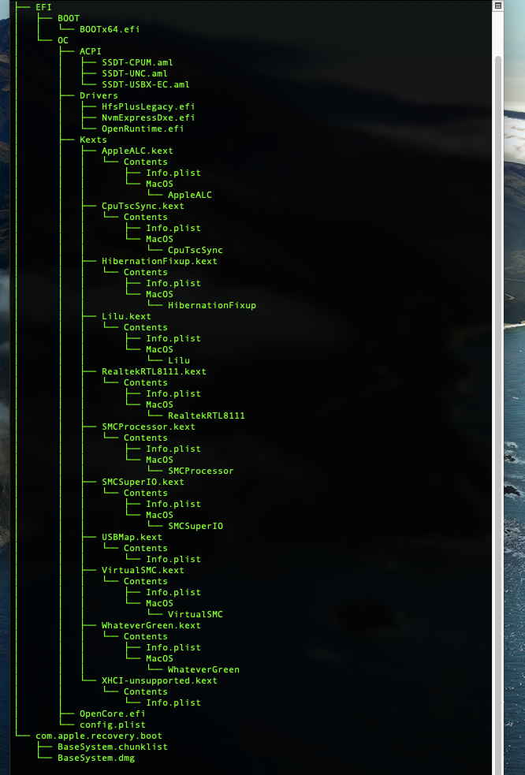
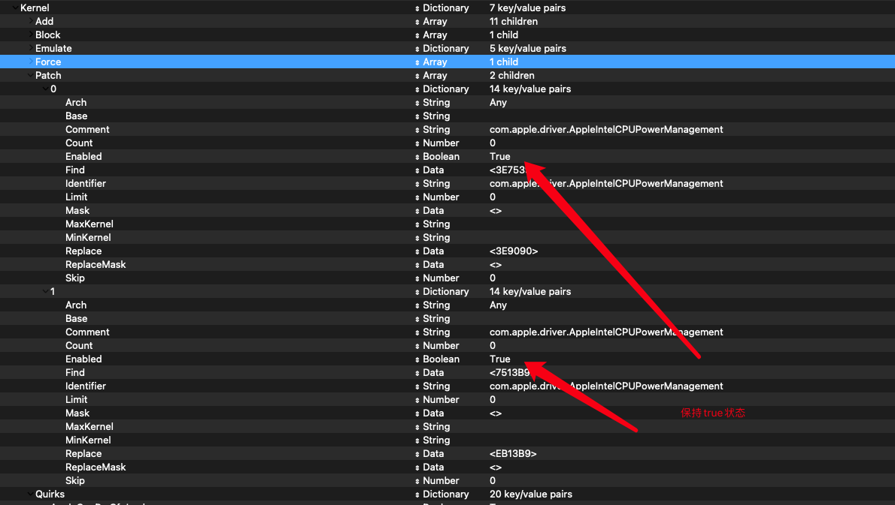
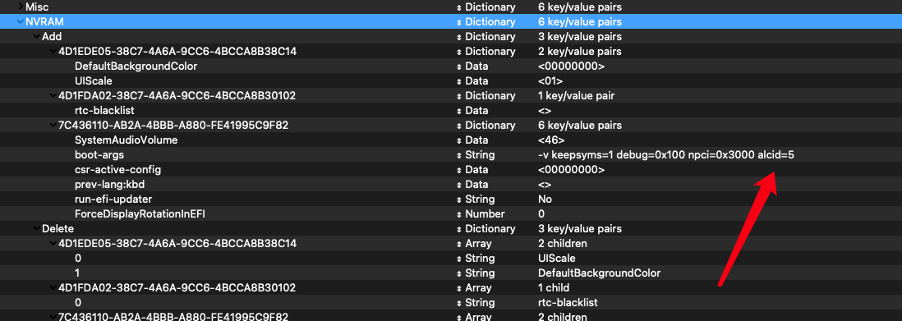

# OpenCore-华南x79_e5 2670 v1 c2 v2 rx588


### 介绍
- 项目由峨眉山市雅铭网络工作室维护，主要适配华南x79 主板对apple的Mac OS安装适配
- 当前仓库代码支持OS版本：10.9-11.5.2正式版全系列安装运行，经过多款华南x79主板验证完全运行正常及其个别声卡驱动id不适配需要自行处理。
- 10.13.x适配完成该版本机型默认iMac Pro1,1最低系统支持10.13.2如果低于那么会出现禁止符号
- 现在支持linux使用oc来引导了
### 软件硬件 ###
- 主板具体型号：华南X79主板印有 华南金牌 ver2.4.x 蓝色四内存槽版本 主板BIOS V2.47
- 目前经过测试的相关华南x79主板基本上都能直接安装个别双路版本的由于没有该板型不知道具体情况
- x79版型众多请谨慎选择

### 注意事项 ###
- 新开企鹅交流群感谢各位关注为各位处理cpu变频问题 
- 千人群号591391580
- 对两个可用smbios机型支持添加一个说明
- Mac pro 6,1 该机型支持最低系统为10.9.0
- iMac pro1,1 该机型支持最低系统版本为：10.13.2
- 如果要安装的系统低于支持的机型最低系统版本将会出现禁止符号
- 仓库内最新代码均为测试中代码，不建议使用，请于发布页面下载稳定版本
### 安装教程 ###
- 开始安装之前
- 注意bios设置
- 禁用 CSM
- 安装时间选择抹掉磁盘请直接抹掉为apfs格式
- 原厂BIOS在0.6.7版本中已经支持 无需做任何设置均可直接安装

# 文件夹结构说明
类别 | 描述
:--- | :---
**clover-x79** | 最后维护的存档
**OpenCore** | 新的主要维护,新驱动验证完成不在区分v1与v2差别了
**tools** | 工具维护
**ocvalidate** | 对应版本config配置合规性检查器
**ssdt** | 该目录为一些参考的参数以及代码
**docs** | 未来的说明文档存放路径
---

# mac下制作制作安装U盘
系统版本 | 使用的命令 | 备注 | 官方商店获取地址
:--- | :--- | :--- | :---
**macOS Monterey** | sudo /Applications/Install\ macOS\ Monterey\ beta.app /Contents/Resources/createinstallmedia --volume /Volumes/usbmac | 其中usbmac为你自己的U盘名称 | [macOS Monterey]() 
**macOS BigSur** | sudo /Applications/Install\ macOS\ Big\ Sur.app/Contents/Resources/createinstallmedia --volume /Volumes/usbmac | 其中usbmac为你自己的U盘名称 | [macOS BigSur](https://apps.apple.com/cn/app/macos-big-sur/id1526878132?mt=12)
**macOS Catalina** | sudo /Applications/Install\ macOS\ Catalina.app/Contents/Resources/createinstallmedia --volume /Volumes/usbmac | [macOS Catalina](https://itunes.apple.com/cn/app/macos-catalina/id1466841314?ls=1&mt=12) 
**macOS Mojave** | sudo /Applications/Install\ macOS\ Mojave.app/Contents/Resources/createinstallmedia --volume /Volumes/usbmac | [macOS Mojave](https://itunes.apple.com/cn/app/macos-mojave/id1398502828?ls=1&mt=12) 
**macOS High Sierra** | sudo /Applications/Install\ macOS\ High\ Sierra.app/Contents/Resources/createinstallmedia --volume /Volumes/usbmac | [macOS High Sierra](https://itunes.apple.com/cn/app/macos-mojave/id1398502828?ls=1&mt=12) 
**macOS El Capitan** | sudo /Applications/Install\ OS\ X\ El\ Capitan.app/Contents/Resources/createinstallmedia --volume /Volumes/usbmac --applicationpath /Applications/Install\ OS\ X\ El\ Capitan.app | [macOS El Capitan](http://updates-http.cdn-apple.com/2019/cert/061-41424-20191024-218af9ec-cf50-4516-9011-228c78eda3d2/InstallMacOSX.dmg) 
---

# 在Mac下制作虚拟机用的iso镜像

- 首先下载我们需要的系统镜像我们用macOS Big Sur举例说明

- 1、创建一个用于镜像制作的空dmg文件镜像并且挂载 ```hdiutil attach /tmp/BigSur.dmg -noverify -mountpoint /Volumes/BigSur```
- 2、写入镜像道dmg盘```sudo /Applications/Install\ macOS\ Big\ Sur.app/Contents/Resources/createinstallmedia --volume /Volumes/BigSur --nointeraction```
- 3、卸载写好后的磁盘```hdiutil detach /volumes/"Install macOS Big sur"```
- 4、转换dmg镜像为cdr格式,并且拷贝到桌面```hdiutil convert /tmp/BigSur.dmg -format UDTO -o ~/Desktop/BigSur.cdr```
- 5、重命名为iso格式```mv ~/Desktop/BigSur.cdr ~/Desktop/BigSur.iso```
- 6、删除不在需要的临时文件```rm -rf /tmp/BigSur.dmg``` 
- 这样我们就制作完成了，可以往虚拟机里面安装了。

# win下创建安装u盘
### 首先，您需要以下内容：
- 4GB U盘
- [macrecovery](/OpenCore/docs/macrecovery)这里必须安装[python](https://www.python.org/downloads/)
- 下载macOS
- 这里开始我们要进入下载的目录内
- 
- ```cd /d clover-x79-e5-2670-rx588/OpenCore/docs/macrecovery```
- 现在根据您想要的 macOS 版本运行以下之一（请注意，这些脚本依赖于 [Python](https://www.python.org/downloads/)（打开新窗口）支持，如果您尚未安装，请安装：
- Lion(10.7):```python macrecovery.py -b Mac-2E6FAB96566FE58C -m 00000000000F25Y00 download```或者```python macrecovery.py -b Mac-C3EC7CD22292981F -m 00000000000F0HM00 download```
- Mountain Lion(10.8):```python macrecovery.py -b Mac-7DF2A3B5E5D671ED -m 00000000000F65100 download```
- Mavericks(10.9):```python macrecovery.py -b Mac-F60DEB81FF30ACF6 -m 00000000000FNN100 download```
- Yosemite(10.10):```python macrecovery.py -b Mac-E43C1C25D4880AD6 -m 00000000000GDVW00 download```
- El Capitan(10.11):```python macrecovery.py -b Mac-FFE5EF870D7BA81A -m 00000000000GQRX00 download```
- Sierra(10.12):```python macrecovery.py -b Mac-77F17D7DA9285301 -m 00000000000J0DX00 download```
- High Sierra(10.13):```python macrecovery.py -b Mac-7BA5B2D9E42DDD94 -m 00000000000J80300 download```或者```python macrecovery.py -b Mac-BE088AF8C5EB4FA2 -m 00000000000J80300 download```
- Mojave(10.14):```python macrecovery.py -b Mac-7BA5B2DFE22DDD8C -m 00000000000KXPG00 download```
- Catalina(10.15):```python macrecovery.py -b Mac-00BE6ED71E35EB86 -m 00000000000000000 download```
- Big Sur(11):```python macrecovery.py -b Mac-E43C1C25D4880AD6 -m 00000000000000000 download```
- 现在我们等待一些时间即可下载好需要的系统镜像
- 
- 开始建立USB引导驱动
- 我们开始格式化u盘 执行```Windows + R ``` ```运行diskpart```
- 显示当前磁盘列表```list disk```
- 选中USB驱动磁盘```select disk 1``` 其中1为看到的磁盘位置id请替换为自己的
- 清除磁盘```clean```
- 将磁盘转换为GPT分区```convert gpt```
- 创建物理分区```create partition primary```
- 选中物理分区```select partition 1```
- 格式化分区为FAT32格式 ```format fs=fat32 quick```
- 分配盘符为E，与机器现有磁盘的盘符不冲突即可非固定```ASSIGN LETTER=E```
- 接下来进入USB驱动器的根目录，创建一个名为com.apple.recovery.boot的文件夹```md com.apple.recovery.boot```
- 然后移动下载的BaseSystem或RecoveryImage文件。请确保您通过.dmg和.chunklist文件复制到此文件夹:
- 
- 完成后我们看到的应该是这样
- 
- 这样就完整的创建好了。
- 完全正确的U盘内的目录结构应该是这样：

### 维护计划
- 四叶草由于驱动不再进行兼容测试不再维护。
- open core每次稳定版发布一周内推送新版
- [open core自行配置发布版下载地址](https://gitee.com/yaming-network/OpenCorePkg/releases/)
#### 配置编辑器地址 ####
- [GenSMBIOS生成三码必备工具](https://gitee.com/yaming-network/GenSMBIOS)
- ``` git clone https://gitee.com/yaming-network/GenSMBIOS```
- ```cd GenSMBIOS ```
- ```chmod +x GenSMBIOS.command```
- [ProperTree](https://gitee.com/yaming-network/ProperTree)
- ```git clone https://gitee.com/yaming-network/ProperTree```
- ```python ./ProperTree/ProperTree.command```
- 配置器使用需要安装[python环境](https://www.python.org/downloads/)
- 修复配置器在[MacOS Big Sur macOS 11上面崩溃的问题](https://www.python.org/downloads/mac-osx/)下载最新版本安装后 使用脚本目录内的```buildapp-python3.command```生成app后即可正常使用
- win最少需要在版本win10 1703以上系统安装py后执行```ProperTree.bat```即可运行编辑器
- 请勿使用occ配置器编辑配置文件，因为如果版本错误会损坏配置文件导致各种异常
### [版本说明日志点击查看](/Changelog.md) ###
# ACPI 内对应ssdt说明
名称 | 作用 | 是否必须
:--- | :--- | :---
**SSDT-UNC.aml** | **所有X99和许多X79板都需要这个SSDT，它专门禁用ACPI中的未使用设备，随后IOPCIFamily不会内核恐慌。这对于最终用户来说只需要很少的配置** | **是**
**SSDT-SBUS-MCHC** | **这一部分涉及修复 macOS 中对 AppleSMBus 的支持，什么是 AppleSMBus？那么这个主要处理系统管理总线，它有很多功能,验证是否正常工作指令** | **否**
**SSDT-PMC.aml** | **所有“真正的”300系列主板（不包括Z370），它特别带回了NVRAM支持，对最终用户只需要很少的配置** | **否**
**SSDT-HPET.aml** | **来自三叶草的花式热补丁，如FixIPIC、FixTMR、FixRTC、FixHPET等，当我们完全转换完成后不在需要该ssdt存在** | **否**
**SSDT-PLUG.aml** | **SSDT-PLUG的目的是允许内核的XCPM（XNU的CPU电源管理）管理我们的CPU电源管理，虽然不是必须但是可能会需要存在.** | **否**
**SSDT-EC.aml** | **现在我们在EC中加入了RTC修正用于解决在引导win/Linux时候出现的时间错误** | **否**
**SSDT-USB-Reset-X.aml** | **USB端口固定与usb供电合并了现在** | **否**
**SSDT-USBX-EC.aml** | **ssdt-ec与ssdt-usb合并后的产物** | **是**
**SSDT-CPUM** | **cpu变频修正安装为目的的时候我们可以没有** | **否**
**SSDT-SSDT-IMEI.aml** | **目前我们不需要该ssdt** | **否**
**SSDT-NVMe.aml** | **修正默认nvme磁盘显示外置问题，安装时候我们可以不需要** | **否**
---
### Acpi 内SSDT的生成说明
- 我们现在只需要保障acpi目录内存在SSDT-USBX-EC.aml、SSDT-UNC.aml即可正常进行安装
- ACPI 文件夹内的ssdt除非板型完全一致才可以直接使用以免引起不必要的异常问题
- 尽量自行生成相同的ssdt
- 生成工具使用SSDTTime
- 使用方法安装py运行环境在win下生成自己主板专用的 ``` git clone https://gitee.com/yaming-network/SSDTTime.git ``` 替换到efi里面即可 
# Wi-Fi网卡原拆支持系统说明列表
系统版本 | 支持芯片| 最高支持
:--- | :--- | :---
**Big Sur(11)+** | **BCM943602,BCM94360,BCM94352,DW1560,BCM94350,DW1820A** | **当前最新正式版**
---
### CPU变频修复 ###
#### 开始修复:
- Mac下使用ssdtPRGen.sh生成专属的cpu变频文件 
- 使用之前请打开终端先安装```xcode-select --install``` 命令行开发者工具
- 执行如下命令:
- ```curl -o ~/ssdtPRGen.sh https://gitee.com/yaming-network/ssdtPRGen.sh/raw/master/ssdtPRGen.sh```
- ```wc -c ssdtPRGen.sh```
- ```chmod +x ~/ssdtPRGen.sh```
- 运行 ```sudo ./ssdtPRGen.sh```
- 生成的SSDT-CPUM.aml在 ~/Desktop/CPUssdt目录中
- 放入oc对应目录中替换默认的
- 在0.7.0发布版本之后CPU变频ssdt名称已经统一名称 SSDT-CPUM.aml
### 注意: ###
- ** **
- **仓库内代码默认为开发版，只想稳定使用者请勿直接克隆。**
- ** ** 
#### 部分cpu不仅需要ssdt还需要开启配置文件上面的对应补丁 ####
- 1、ACPI -> Delete 
- 2、v1（32纳米版本的cpu还需要启用内核补丁) 
### alc声卡驱动说明 ###
- alc声卡因为主板不同，携带的声卡芯片也不同我们需要在引导位置注入自己合适的id，如下图：
- 
- 测试好后我们的声卡后我们可以按照如下方式进行固定：
- 
- 对于alc声卡id我们Mac终端自带16进制转换命令```printf '%x\n' 11```这样的意思是将11转换为16进制返回显示b 这样填写就是```0b000000```
# 关于USB驱动定制说明

- 使用仓库内可以找到的USB定制工具 
- 参考[bilibili视频教程](https://www.bilibili.com/video/BV1w44y127Ks?share_source=copy_web)


### 对应自维护机型地址 ###
- [技嘉_b75m_d3v+e3_1230_v2](https://gitee.com/yaming-network/OpenCore-GA-b75)
- [华南x79_e5_2670_c2_v1](https://gitee.com/yaming-network/clover-x79-e5-2670-rx588)
- [github同步地址华南x79_e5_2670c2](https://github.com/wy414012/huaNan_x79_e5_2670_v1_c2)

# [常见问题说明](./常见问题说明.md)


# 鸣谢支持：
名称 | 日期 | 金额 | 渠道
:--- | :--- | :--- | :---
**黄昏** | 2021.3.23 | 9.9元 | 微信红包
**Pteromyini** | 2021.3.29 | 9.9元 | QQ红包
**zhenli** | 2021.3.31 | 9.9元 | QQ红包
**Eawen** | 2021.3.31 | 9.9元 | 微信红包
**Pteromyini** | 2021.4.02 | 5.99元 | QQ红包
**Leoist** | 2021.4.05 | 10元 | QQ红包
**Leoist** | 2021.4.14 | 20元 | QQ红包
**click** | 2021.4.20 | 20元 | QQ红包
**zhenli** | 2021.5.16 | 18.8元 | QQ红包
**水流众生小** | 2021.8.28 | 9.9元 | QQ红包
---
